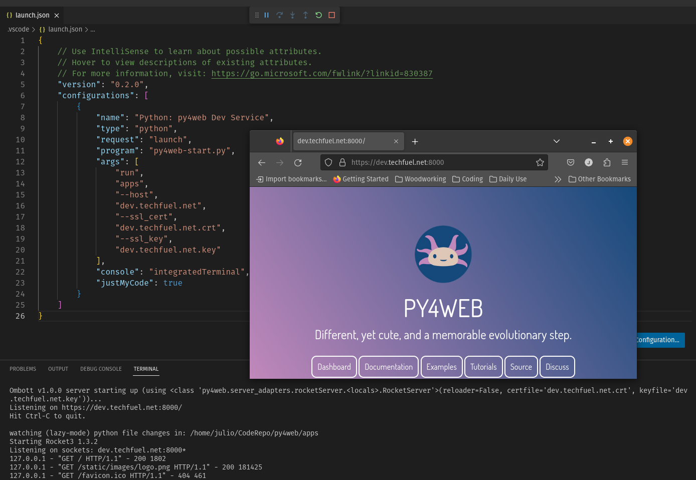
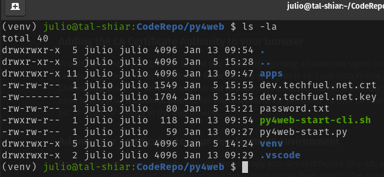

## Enable SSL (https) for local web development (CLI Version)



Although this guide was meant to be used as a guideline to have a full-working SSL environment for py4web development under VSCode, this could also be used for any kind of local web development that requires SSL.

This document targets Linux OS (Specifically Pop!_OS), which should work on any ubuntu-related systems, for other flavors of Linux, or for Windows, your mileage may vary.

### User Story
I need to do local development using SSL, for this example, I will use a custom dev domain based on my main domain which is `techfuel.net`, we'll call this new domain <code><b>dev</b>.techfuel.net</code>. I then procees to add the DEV domain to my `/etc/hosts` file, and specified `127.0.0.1` as the IP address for localhost.

### Initial Setup
Create a folder to contain all the files that this guide will create, open Terminal and change to the newly created folder.

### Create Own CA:
By creating our own "Certificate Authority" it will allow us to "sign" the certificate locally, and allow the web browser to treat the CA as a valid signer. We will use the name **TechfuelCA.key** to create the CA key.

`openssl genrsa -des3 -out TechfuelCA.key 2048`

(You will require to add a passphrase in this step, this is **not** the passphrase of your final SSL certificate, so select a valid passphrase to continue.)

### Generate a "Root" Certificate:
In this step, we create our "Root" CA Certificate (**TechfuelCA.pem**) and sign it with the key created on the above step)

`openssl req -x509 -new -nodes -key TechfuelCA.key -sha256 -days 1825 -out TechfuelCA.pem`

(Answer all questions, no FQDN is required, just a name such "Skunkworks", "Section 31", etc.)

### Make Root Cert available systemwide (Linux/Optional)
For Ubuntu/Linux, enable the root cert systemwide (need to have the ca-certs package installed, which it is in most distros.)

```
sudo cp TechfuelCA.pem /usr/local/share/ca-certificates/TechfuelCA.crt
sudo update-ca-certificates
```

### Create our custom DEV domain certificate
Generate our dev certificate Key:

`openssl genrsa -out dev.techfuel.net.key 2048`

Now Create the actual Certificate Request using the key created on the above step:

`openssl req -new -key dev.techfuel.net.key -out dev.techfuel.net.csr`

(Answer cert questions, **add the fqdn corectly ths time** e.g. dev.techfuel.net)

Create an X509 V3 certificate extension config file, which is used to define the Subject Alternative Name (SAN) for the certificate
(`vim dev.techfuel.net.ext`) and add the content below:
```
authorityKeyIdentifier=keyid,issuer
basicConstraints=CA:FALSE
keyUsage = digitalSignature, nonRepudiation, keyEncipherment, dataEncipherment
subjectAltName = @alt_names

[alt_names]
DNS.1 = dev.techfuel.net
```

(Substitute your DNS.1 entry for your own DEV domain.)

Now, we run the command to create the actual DEV certificate: Using our CSR, the CA's private key, the CA's certificate, and our config file (the days option below can be changed at your discretion:

`openssl x509 -req -in dev.techfuel.net.csr -CA TechfuelCA.pem -CAkey TechfuelCA.key -CAcreateserial -out dev.techfuel.net.crt -days 825 -sha256 -extfile dev.techfuel.net.ext`

Finally, we'll end up with something like this:
```
julio@tal-shiar:CodeRepo/Certs $ ls -la
total 32
drwxrwxr-x 2 julio julio 4096 Jan  5 15:42 .
drwxr-xr-x 5 julio julio 4096 Jan  5 15:28 ..
-rw-rw-r-- 1 julio julio 1549 Jan  5 15:42 dev.techfuel.net.crt (Signed Certificate)
-rw-rw-r-- 1 julio julio 1086 Jan  5 15:38 dev.techfuel.net.csr
-rw-rw-r-- 1 julio julio  207 Jan  5 15:40 dev.techfuel.net.ext
-rw------- 1 julio julio 1704 Jan  5 15:37 dev.techfuel.net.key (Domain Private Key)
-rw------- 1 julio julio 1854 Jan  5 15:29 TechfuelCA.key
-rw-rw-r-- 1 julio julio 1501 Jan  5 15:31 TechfuelCA.pem
```
### Adding the CA Certificate Authority to your browser
In order to prevent your browser to give you a warning regarding an *unknown* signer for your dev certificate, we need to let the browser know that the CA signer is ok. I use both Firefox and Chrome, and there are different ways to add this which you can find online. Ultimately you will need to add your **TechfuelCA.pem** file (or whatever filename you chose as your CA name) to the list of "Root CA" exiting in the web browser.

### Adding your certificates to your development environment
Depending on your requirements, you will need to copy your dev certificates (the .crt, and the .key files.) to your environment, and instruct your application to use them directly, I've used this approach with web2py, py4web, Flask, and several other libraries and frameworks successfully.

### Creating a Visual Studio SSL environment for py4web.
Assuming your environment is properly setup, just copy your .crt and .key files to the root of your VSCode project, as seen below:



Edit (or create) VSCode's own `launch.json` file, and add the following:

```
{
    // Use IntelliSense to learn about possible attributes.
    // Hover to view descriptions of existing attributes.
    // For more information, visit: https://go.microsoft.com/fwlink/?linkid=830387
    "version": "0.2.0",
    "configurations": [
        {
            "name": "Python: py4web Dev Service",
            "type": "debugpy",
            "request": "launch",
            "program": "py4web-start.py",
            "args": [
                "run",
                "apps",
                "--host",
                "dev.techfuel.net",
                "port",
                "8443",
                "--ssl_cert",
                "dev.techfuel.net.crt",
                "--ssl_key",
                "dev.techfuel.net.key"
            ],
            "console": "integratedTerminal",
            "justMyCode": true
        }
    ]
}
```

If all goes well, you should be able to start debugging your py4web-start.py file, open up your browser, and access your https dev location, and start debugging.


