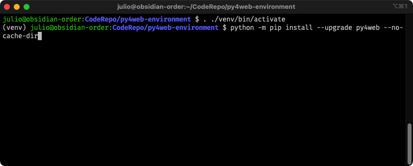

# Debugging py4web on VS Code
This guide provides information on how to setup Visual Studio Code to work with py4web Web Application Framework.

_Although this guide was made targeting MacOS and Linux OS, there should be enough information for Windows users to help them as well._ 

#### Assumptions

- Visual Studio Code is already installed
- Visual Studio Code python extensions are already installed
- Python 3.x is already installed
- User is comfortable using the command line.

#### Setting up the virtual environment.

Create a folder which will contain our virtual environment and access it:

Create a virtual environment to ultimately contain py4web in it using `python3 -m venv venv`

Activate the environment

Install py4web using pip within the environment (Refer to "Installation and Startup" section on the official py4web documentation) `python -m pip install --upgrade py4web --no-cache-dir`

Create an admin password for py4web

Create apps folder and add default applications

Test installation and setup was successful, then Ctrl-C to exit

Copy the standard py4web.py launcher script, renaming it to py4web-start.py - This file will be used by VSCode to initiate a debugging session. `curl -o py4web-start.py https://raw.githubusercontent.com/web2py/py4web/master/py4web.py`

_Note, use the command <mark>curl -o py4web-start.py https://raw.githubusercontent.com/web2py/py4web/master/py4web.py</mark> instead of the command shown on the screen shot, to get the correct file instead._

#### Configuring Visual Studio Code

Open VScode, then open the parent folder containing the newly created virtual environment containing py4web.

Environment Loaded

IMPORTANT - It is important that VSCode "recognize" the virtual environment in order to use the correct python interpreter, and correctly debug py4web, for the most part, VSCode will recognize it and no further action would be needed, but if VSCode does not recognize the virtual environment, please refer to the proper VSCode documentation, at the time of this writing, it is located at [https://code.visualstudio.com/docs/python/environments](https://code.visualstudio.com/docs/python/environments). One way to verify VSCode correctly recognized our new venv, is by looking at the footer section on the VSCode application, as shown below:

Open your startup file, and from the `Run` menu, select `Add Configuration`, then select `Python File`, a newly created `launch.json` file will be created and will show something like below:

Make the necessary modifications, changing the `name` key to something more meaningful, and the `program` key to add the correct information, additionally, you'll need to add a _new_ key `args` to support your py4web arguments, after making the necessary updates, you should end up with something similar to this:

Save the `launch.json` file and optionally close it.

Select `Run` and then `Start Debugging`, and the entire framework will be running inside VSCode:

You may now access the instance from your browser, set up brakepoints in your applications, or in the framework itself.

Happy debugging.

Julio.

